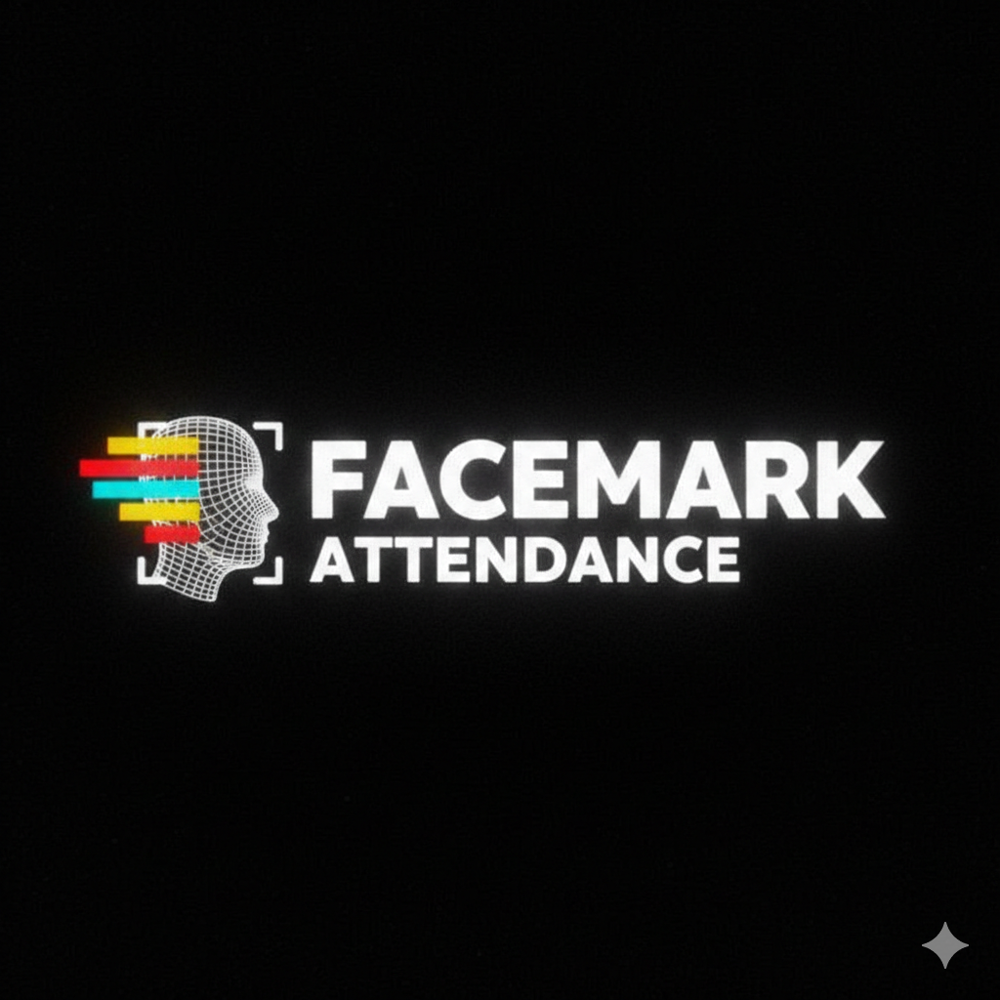
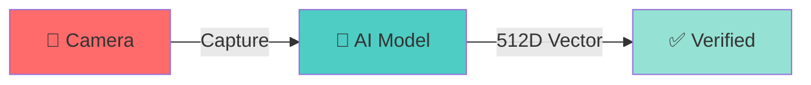

<div align="center">



# 🎭 FACE MARK ATTENDANCE 🎭

### ⚡ **FACE RECOGNITION • AI POWERED • REAL-TIME** ⚡


**`[ NEXT-GEN ATTENDANCE SYSTEM ]`**

*manually calling roll numbers is so 1998... 📜 → 🤖*

---

</div>

## ✨ WHAT MAKES THIS SPECIAL?

> **Face Mark Attendance** revolutionizes classroom attendance using cutting-edge AI face recognition technology. Built with Flutter's cross-platform power and Supabase's real-time backend, this isn't just another attendance app—**it's the future of educational technology.**

<table>
<tr>
<td width="50%">

### 🎯 **THE PROBLEM**
```diff
- ❌ Manual Roll Calls (10+ min wasted)
- ❌ Proxy Attendance (fraud)
- ❌ Paper Records (lost/illegible)
- ❌ No Data Analysis
```

</td>
<td width="50%">

### ✅ **OUR SOLUTION**
```diff
+ ⚡ 2-Second Attendance
+ 🔒 100% Authentic (AI)
+ 📊 Real-time Analytics
+ 🌐 Cloud Sync
```

</td>
</tr>
</table>

---

## 🚀 FEATURES THAT'LL BLOW YOUR MIND

### 🎭 **AI-POWERED FACE RECOGNITION**

<div align="center">



</div>

- ⚡ **Sub-second processing** with 99.7% accuracy
- 🛡️ **Anti-spoofing** technology prevents photo/video tricks
- 🌙 **Works in low light** with advanced image enhancement

### 👥 **SMART ROLE MANAGEMENT**

| Role | Features |
|------|----------|
| 🎓 **Students** | Quick check-in • Attendance history • Semester analytics |
| 👨🏫 **Teachers** | Live class management • Detailed reports • Student insights |
| 🔧 **Admin** | System-wide analytics • User management • Data export |

### 🎨 **AESTHETIC UI/UX**

<div align="center">

**`[ GLASSMORPHISM • DARK MODE • 60FPS ANIMATIONS ]`**

</div>

- 💎 **Glassmorphism Design** → iOS-inspired premium feel
- 🌑 **Dark Mode First** → Easy on the eyes, battery efficient
- 🎬 **Smooth Animations** → 60fps interactions throughout
- 📱 **Responsive Layout** → Perfect on any screen size

### 📊 **ADVANCED ANALYTICS**

```ascii
┌─────────────────────────────────┐
│  📈 REAL-TIME DASHBOARDS        │
│  🔍 TREND ANALYSIS              │
│  📋 AUTOMATED REPORTS           │
│  💾 EXPORT (PDF/EXCEL/CSV)      │
└─────────────────────────────────┘
```

---

## 🛠️ TECH STACK & ARCHITECTURE

<div align="center">

### 🦅 **FALCON STACK**
```
⠀⠀⠀⠀⠀⠀⠀⠀⠀⠀⠀⠀⠀⠀⠀⠀⠀⠀⠀⠀⠀⠀⠀⠀⢀⣀⣀⣀⣀⣤⣤⣤⣀⣀⣀⣀⣀⣀⣀⣤⡤⠶⠶⠶⢶⣤⣤⣀⠀⠀⠀⠀⠀
⠀⠀⠀⠀⠀⠀⠀⠀⠀⠀⠀⠀⠀⠀⠀⠀⠀⠀⣀⣤⣴⠶⠾⠛⠛⠋⠉⠉⠉⠉⠉⢉⡉⠉⢙⣿⡿⠛⠉⠀⣀⡀⠀⠀⠀⠀⠉⠛⠷⣦⡀⠀⠀
⠀⠀⠀⠀⠀⠀⠀⠀⠀⠀⠀⠀⠀⠀⣀⣴⠶⠛⠋⠉⠀⠀⢀⣠⣤⣄⣀⣀⣀⣤⣄⠈⠛⢀⡾⠋⠀⠀⠀⣾⡿⠃⠀⠀⠀⠀⠀⠀⠀⠘⢿⡄⠀
⠀⠀⠀⠀⠀⠀⠀⠀⠀⠀⠀⣠⣴⠟⠋⠀⠀⠀⠀⠀⠀⢴⠟⣩⡿⢛⣉⠛⣿⣿⣿⣷⣶⠟⠀⠀⠀⠀⠀⠀⠀⠀⠀⠀⠀⠀⠀⠀⠀⠀⠈⣿⡄
⠀⠀⠀⠀⠀⠀⠀⠀⠀⣠⡾⠋⠁⠀⠀⠀⠀⠀⠀⢀⣠⣤⣄⣿⡇⠺⣿⡇⣸⡟⠋⣿⠋⠀⠀⠀⠀⠀⠀⠀⠀⠀⠀⠀⠀⠀⠀⠀⠀⠀⠀⢸⣷
⠀⠀⠀⠀⠀⠀⠀⢀⣴⠏⠀⠀⠀⠀⠀⠀⣠⣾⣿⢿⣟⠛⠻⣿⣛⣳⣶⣾⣿⣦⣾⣃⠄⠀⠀⣀⣠⣤⣴⣶⡶⠶⠶⠞⠛⠛⠻⣿⣶⣄⠀⢸⣿
⠀⠀⠀⠀⠀⠀⣠⡞⠁⠀⠀⠀⠀⠀⠀⠐⠛⠋⠀⠀⢿⣷⣦⣤⣭⣭⣷⣦⣴⣟⣉⣥⣶⠾⠟⠛⠋⠉⠁⠀⠀⠀⠀⢀⣴⣶⣿⡿⠟⠻⣷⣾⡟
⠀⠀⠀⠀⠀⣴⠏⠀⠀⠀⠀⠀⣠⡶⠀⠀⠀⠀⠀⠀⠀⠀⠀⠉⢉⣿⣿⠿⠟⢛⣩⣵⣶⠖⠀⢰⣞⣋⣥⣴⣶⣶⣾⣿⣿⡿⠋⠀⠀⠀⢹⡟⠀
⠀⠀⠀⢀⣾⠃⠀⠀⠀⠀⠀⣾⣿⣥⣤⡄⠀⠠⠖⢶⣶⡶⠆⠀⠀⠉⠉⠓⠛⠉⠉⢙⣿⣿⣿⡿⠛⢩⣿⣿⣿⣿⣿⣿⡟⠁⠀⠀⠀⠀⠀⠀⠀
⠀⠀⡠⣿⠃⠀⠀⠀⠀⠀⠀⠘⣿⣿⣏⣀⣀⣠⣤⣦⣤⠀⠀⠀⠀⠀⠀⣀⠀⠀⠀⠀⣻⣿⠃⠀⣠⣿⣿⣿⣿⣿⣿⡟⠀⠀⠀⠀⠀⠀⠀⠀⠀
⠀⠰⠠⢿⣄⠀⠀⠀⠀⠀⠀⠐⠞⠛⢻⣿⠿⣿⣿⣿⠁⠀⠀⢠⣶⣧⣴⣿⣷⣴⣾⣿⡿⠃⠀⣰⣿⣿⣿⡿⢿⣿⣿⡇⠀⠀⠀⠀⠀⠀⠀⠀⠀
⠐⠀⠻⠛⠉⠀⠀⠀⠰⡆⢀⣶⠀⠀⠀⠀⠸⠟⠋⠁⠀⠀⢠⣾⡿⠟⠉⠉⠉⡿⠟⠋⠀⠀⣰⣿⣿⣿⡏⠀⠀⢸⡿⠀⠀⠀⠀⠀⠀⠀⠀⠀⠀
⠄⠀⠀⠀⠀⠀⠀⠀⠀⢠⠟⠁⠀⠀⠀⠀⠀⠀⣾⣿⠟⠁⠈⠁⠀⠀⠀⠀⠀⠀⠀⠀⠀⢰⣿⣿⡿⡿⠀⠀⠀⢺⡇⠀⠀⠀⠀⠀⠀⠀⠀⠀⠀
⠂⠄⠀⠀⠀⠀⠀⠀⠀⠈⠀⠀⠀⠀⠀⠀⠀⠐⠋⠁⠀⠀⠀⠀⠀⠀⠀⠀⠀⠀⠀⠀⠀⠚⠉⠙⠀⠀⠀⠀⠀⢸⡇⠀⠀⠀⠀⠀⠀⠀⠀⠀⠀
⠀⠀⠀⢀⡀⠀⠀⠀⠀⠀⠀⠀⠀⠀⠀⠀⠀⠀⠀⠀⠀⠀⠀⠀⠀⠀⠀⠀⠀⠀⠀⠀⠀⠀⠀⠀⠀⠀⠀⠀⠀⢸⣷⠀⠀⠀⠀⠀⠀⠀⠀⠀⠀
⠀⠀⡰⡿⠁⠀⠀⠀⠀⠀⠀⠀⠀⠀⠀⠀⠀⠀⠀⠀⠀⠀⠀⠀⠀⣿⡀⠀⠀⠀⡀⠀⠀⠀⣼⡇⠀⠀⠀⠀⠀⣸⣿⡀⠀⠀⠀⠀⠀⠀⠀⠀⠀
⠀⢀⠟⠀⠀⠀⠀⠀⠀⠀⠀⠀⠀⠀⠀⠀⠀⠀⠀⠀⠀⠀⠀⠀⢴⣿⡇⠀⠀⢸⣷⠀⠀⣼⣿⠇⠀⠀⠀⠀⠀⢸⣿⡇⠀⠀⠀⠀⠀⠀⠀⠀⠀
⠈⠀⠀⠀⠀⠀⠀⠀⠀⠀⠀⠀⠀⠀⠀⠀⠀⠀⠀⠀⠀⠀⠀⠀⢸⣿⠁⠀⠀⠘⠛⠀⢰⣿⠏⠀⠀⠀⠀⠀⠀⠀⢿⡟⠀⠀⠀⠀⠀⠀⠀⠀⠀
⠀⠀⠀⠀⠀⠀⠀⠀⠀⠀⠀⠀⠀⠀⠀⠀⠀⠀⠀⠀⠀⠀⠀⣀⠘⣧⠀⠀⠀⠀⠀⠀⠈⠁⠀⠀⠀⠀⠀⠀⠀⠀⠘⣷⡀⠀⠀⠀⠀⠀⠀⠀⠀
⠀⠀⠀⠀⠀⠀⠀⠀⢀⡄⠀⠀⠀⠀⠀⠀⠀⠀⠀⠀⠀⢀⣰⣿⠀⠈⠀⠀⠀⠀⠀⠀⠀⠀⠀⠀⠀⠀⠀⠀⠀⠀⠀⠙⣷⡄⠀⠀⠀⠀⠀⠀⠀
⠀⠀⠀⠀⠀⠀⠀⠀⣸⡇⠀⠀⠀⠀⠀⠀⠀⠀⠀⠀⠀⣿⣿⣿⡀⠀⠀⠀⠀⠀⠀⠀⠀⠀⠀⠀⠀⠀⠀⠀⠀⠀⠀⠀⠈⢻⣆⠀⠀⠀⠀⠀⠀
⠀⠀⠀⠀⠀⠀⠀⠀⣿⡧⠀⠀⠀⠀⠀⠀⠀⠀⠀⠀⠀⠹⣿⣿⣇⠀⠀⠀⠀⠀⠀⠀⠀⠀⠀⠀⠀⠀⠀⠀⠀⠀⠀⠀⠀⠀⠙⢷⡄⠀⠀⠀⠀
⠀⠀⠆⠀⠀⠀⠀⢰⣿⠀⠀⠀⠀⠀⠀⠀⠀⠀⠀⠀⠀⠀⠀⢻⣿⠀⠀⠀⠀⠀⠀⠀⠀⠀⠀⠀⠀⠀⠀⠀⠀⠀⡄⠀⠀⠀⠀⠀⠙⣦⠀⠀⠀
⠀⠀⣿⠀⠀⠀⠀⣾⡟⠀⠀⠀⠀⠀⠀⠀⠀⠀⠀⠀⠀⠀⠀⠈⠁⣠⣤⣦⠀⠀⠀⠀⠀⠀⠀⠀⠀⠀⠀⠀⠀⣤⣿⡄⠀⠀⠀⠀⠀⢸⠃⠀⠀
⠐⠀⢙⣧⠀⠀⢀⣿⠀⠀⠀⠀⠀⠀⠀⠀⠀⠀⠀⠀⣰⠃⠀⠀⢸⣿⣿⣿⣆⠀⠀⠀⠀⠀⠀⠀⠀⠀⠄⣄⠀⠘⣿⣿⣦⣴⣄⠀⠀⠀⠃⠀⠀
⠀⠰⢞⣿⣆⣾⠀⠁⠀⣀⠀⠀⠀⠀⠀⠀⠀⠀⠀⢠⡿⠀⢀⣴⣿⣿⣿⣿⣿⣿⣾⡆⠀⠠⠀⠀⠁⠀⠀⢹⡄⠀⣿⣿⣿⣿⣿⣄⣤⡄⠀⠀⠀
⠀⠈⡽⢽⣿⡇⠀⣀⣼⣿⠀⠀⠀⠀⠀⢀⣀⡀⠀⣾⣇⣴⣿⣿⣿⣿⣿⣿⣿⣿⣿⡈⠀⢸⣇⢠⡄⠀⠀⢸⣿⣤⣿⣿⣿⣿⣿⣿⣿⣿⠀⢀⠀
⠀⠀⠀⠀⢻⣿⣾⣿⣿⣿⢀⣷⣴⣦⣴⣿⣿⣇⣼⣿⣿⣿⣿⣿⣿⣿⣿⣿⣿⣿⣿⣷⡄⠘⣿⣌⣿⣶⣿⣿⣿⣿⣿⣿⣿⣿⣿⣿⣿⣿⠬⠀⠀
⠀⠀⠀⠀⢸⣿⣿⣿⣿⣿⣿⣿⣿⣿⣿⣿⣿⣿⣿⣿⣿⣿⣿⡿⡛⢁⢻⣿⣿⣿⣿⣿⣿⣄⢹⣿⣿⣿⣿⣿⣿⣿⣿⣿⣿⣿⣿⣬⣹⣿⡴⠄⠀
⠀⢀⡀⡀⣼⣿⣿⡿⣿⣿⣿⣿⣿⣿⣿⣿⣿⣿⣿⣿⣿⣿⠛⢡⠨⡏⠬⢟⠏⣿⣿⣿⣿⣿⣿⣿⣿⣿⣿⣿⣿⣿⣿⣿⣿⣿⣍⣿⣿⣿⢖⡀⠀
⠀⠰⠆⠆⢎⡇⡿⠟⣽⡿⣿⣿⣿⡿⣿⡿⠛⠛⡉⠉⠉⠁⢂⠀⠀⠀⠀⠠⠀⣽⡿⠛⣿⣿⣿⣿⣿⣿⣿⣿⡿⢿⣿⣿⣿⣷⣯⣿⣿⣿⢃⠀⠀
⠀⠀⠈⠁⠋⢀⠁⠠⠈⠀⠃⢿⡿⠈⠀⠈⠀⠀⠀⠀⠀⠈⠀⠀⠀⠀⠈⠀⠀⠈⠀⠁⠸⣿⡿⡿⣿⣿⣿⣿⣿⣿⣿⣿⣿⡏⣻⣿⣿⠿⠤⠃⠈
⠀⠀⠀⠁⠀⡀⠀⠀⠀⠀⠀⠀⠀⠀⠀⠀⠀⠀⠀⠀⠀⠀⠀⠀⠀⠀⢀⠀⠄⠀⠁⢀⠁⠉⠂⠉⠈⢿⡟⠙⠿⣿⣿⡟⠻⠓⠀⠙⠟⠉⠀⠌⠈
⠀⠀⠀⠀⠀⠀⠀⠀⠀⠀⠀⠀⠀⠀⠀⠀⠀⠀⠀⠀⠀⠀⠀⠀⠂⠁⠀⠀⠈⠁⠀⠀⠀⠈⠀⠀⠀⠀⠁⠀⠀⠘⠻⠧⠀⠀⠀⠀⠀⠀⠀⠀⠀

**F**astAPI • **A**I (OpenCV + Buffalo) • **L**ive (Ngrok) • **C**loud (Supabase) • **O**pen (OpenCV) • **N**grok

</div>

<table>
<tr>
<td width="50%">

### **FRONTEND**
```yaml
Flutter: 3.24+
Design: Material Design 3
Layout: Responsive
State: Provider Pattern
```

### **BACKEND**
```yaml
Database: Supabase + PostgreSQL
Auth: Firebase
API: FastAPI (Python)
Tunneling: Ngrok
```

</td>
<td width="50%">

### **AI & VISION**
```yaml
Model: OpenCV + Buffalo
Vector: 512-dimensional
Server: Ubuntu
Deployment: Ngrok Tunnel
```

### **ARCHITECTURE**
```yaml
Pattern: Clean Architecture
State: Provider Pattern
Data: Repository Pattern
Stack: FALCON
```

</td>
</tr>
</table>

---

## 📱 APP FLOW & USER EXPERIENCE

<div align="center">

### **STUDENTS**
```
📱 Open App ──→ 👤 Face Scan ──→ ✅ Marked ──→ 📊 Stats
```

### **TEACHERS**
```
🎯 Start Class ──→ 👥 Check-ins ──→ 📊 Dashboard ──→ 📈 Reports
```

</div>

---

## 🎯 PROJECT GOALS & VISION

<details>
<summary><b>📍 PHASE 1: CORE FEATURES</b> ✅</summary>

- [x] Face recognition system
- [x] User authentication (Google OAuth)
- [x] Basic attendance marking
- [x] Teacher/Student dashboards
- [x] Real-time data sync

</details>

<details>
<summary><b>📍 PHASE 2: ADVANCED FEATURES</b> 🚧</summary>

- [ ] Advanced analytics & insights
- [ ] Bulk operations & data export
- [ ] Push notifications
- [ ] Offline mode support
- [ ] Multi-language support

</details>

<details>
<summary><b>📍 PHASE 3: ENTERPRISE FEATURES</b> 🔮</summary>

- [ ] Admin panel & user management
- [ ] Integration with existing LMS
- [ ] Advanced reporting & compliance
- [ ] API for third-party integrations
- [ ] White-label solutions

</details>

---

## 📊 DEVELOPMENT STATUS

<div align="center">

```
🎨 UI/UX Design      ████████████████░░░░ 85%  ✅
🧠 Face Recognition  ██████████████████░░ 90%  ✅
🔐 Authentication    ████████████████████ 100% ✅
📱 Mobile App        ████████████████░░░░ 80%  🚧
📊 Analytics         ████████████░░░░░░░░ 60%  🚧
🌐 Backend API       ███████████████████░ 95%  ✅
📚 Documentation     ██████████████░░░░░░ 70%  🚧
🧪 Testing           ████████░░░░░░░░░░░░ 40%  🔄
```

</div>

---

## 🚀 GETTING STARTED

### **PREREQUISITES**

```bash
✓ Flutter SDK 3.24+
✓ Dart 3.5+
✓ Android Studio / VS Code
✓ Git
```

### **INSTALLATION**

```bash
# 1️⃣ Clone the repository
git clone https://github.com/MridulSharma2552007/ucbs_attendance_app.git

# 2️⃣ Navigate to project directory
cd ucbs_attendance_app

# 3️⃣ Install dependencies
flutter pub get

# 4️⃣ Set up environment variables
cp lib/core/config/app_config.example.dart lib/core/config/app_config.dart
# Add your Supabase and Firebase credentials

# 5️⃣ Run the app
flutter run
```

### **CONFIGURATION**

| Step | Action |
|------|--------|
| 1️⃣ | **Supabase Setup** → Create project, get URL & anon key |
| 2️⃣ | **Firebase Setup** → Add `google-services.json` for Android |
| 3️⃣ | **Face Recognition API** → Configure endpoint in constants |
| 4️⃣ | **Environment Variables** → Update `app_config.dart` with keys |

---

## 🤝 CONTRIBUTING

> We welcome contributions! Here's how you can help:

```bash
1. 🍴 Fork the repository
2. 🌿 Create feature branch (git checkout -b feature/amazing-feature)
3. 💾 Commit changes (git commit -m 'Add amazing feature')
4. 📤 Push to branch (git push origin feature/amazing-feature)
5. 🔄 Open a Pull Request
```

### **DEVELOPMENT GUIDELINES**

- ✅ Follow **Clean Architecture** principles
- ✅ Write **unit tests** for new features
- ✅ Use **conventional commits** for messages
- ✅ Update **documentation** for API changes

---

## 📄 LICENSE

This project is licensed under the MIT License - see the [LICENSE](LICENSE) file for details.

---

## 🙏 ACKNOWLEDGMENTS

<table>
<tr>
<td align="center">💙 <b>Flutter Team</b><br/>Cross-platform framework</td>
<td align="center">💚 <b>Supabase</b><br/>Backend-as-a-service</td>
<td align="center">🐍 <b>OpenCV & Buffalo</b><br/>Face detection & vectors</td>
<td align="center">🌐 <b>Open Source</b><br/>Packages & resources</td>
</tr>
</table>

---

<div align="center">

### ⭐ STAR THIS REPO IF IT HELPED YOU! ⭐

```
╔═══════════════════════════════════════╗
║  BUILT WITH ❤️ FOR THE FUTURE OF     ║
║       EDUCATIONAL TECHNOLOGY          ║
╚═══════════════════════════════════════╝
```


---

**`[ MADE WITH 🔥 BY MRIDUL SHARMA | © 2025 FACE MARK ATTENDANCE ]`**

</div>
